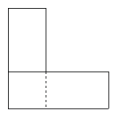

<!-- question-source:start -->
【练习 2】 1.有一个长方形，如果长减少4米，宽减少2米，面积就比原来减少44平方米，且剩下部分正好是一个正方形。求这个正方形的周长。
2.有两个相同的长方形，长是8厘米，宽是3厘米，如果按下图叠放在一起，这个图形的周长是多少？
3.有一块长方形广场，沿着它不同的两条边各划出2米做绿化带，剩下的部分仍是长方形，且周长为280米。求划去的绿化带的面积是多少平方米？
<!-- question-source:end -->

![[小学/奥数/小学奥数举一反三五年级/第03讲_长方形正方形周长/练习/answers/Q00094000A1.md]]
