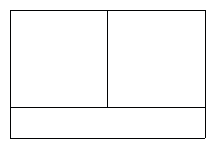

<!-- question-source:start -->
【练习 3】 1.有一张长40厘米，宽30厘米的硬纸板，在四个角上各剪去一个同样大小的正方形后准备做一个长方体纸盒，求被剪后硬纸板的周长。
2.一个长12厘米，宽2厘米的长方形和两个正方形正好拼成下图（1）所示长方形，求所拼长方形的周长。
3.求下面图形（图2）的周长（单位：厘米）。

<!-- question-source:end -->

![[小学/奥数/小学奥数举一反三五年级/第03讲_长方形正方形周长/练习/answers/Q00094001A1.md]]
