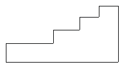
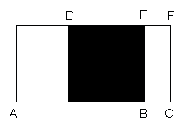

<!-- question-source:start -->
【练习 4】 1.求下面图形的周长（单位：厘米）。
2.在（ ）里填上"＞"、"＜"或"="。甲的周长（ ）乙的周长
3.下图中的每一小段的长度都相等，求图形的周长。

<!-- question-source:end -->

![[小学/奥数/小学奥数举一反三五年级/第03讲_长方形正方形周长/练习/answers/Q00094002A1.md]]
