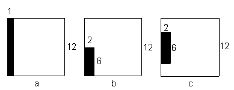
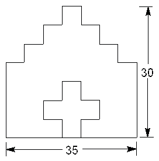

<!-- question-source:start -->
【练习 5】 1.下面三个正方形的面积相等，剪去阴影部分的面积也相等，求原来正方形的周长发生了什么变化？（单位：厘米）
2.下面是一个零件的平面图，图中每条短线段都是5厘米，零件长35厘米，高30厘米。这个零件的周长是多少厘米？
3.有两个相同的长方形，长7厘米，宽3厘米，如下图重叠着，求重叠图形的周长。
<!-- question-source:end -->

![[小学/奥数/小学奥数举一反三五年级/第03讲_长方形正方形周长/练习/answers/Q00094003A1.md]]
