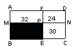

<!-- question-source:start -->
【练习 2】 1.下图一个长方形被分成四个小长方形，其中三个长方形的面积分别是24平方厘米、30平方厘米和32平方厘米，求阴影部分的面积。
2.下面一个长方形被分成六个小长方形，其中四个长方形的面积如图所示（单位：平方厘米），求A和B的面积。
3.下图中阴影部分是边长5厘米的正方形，四块完全一样的长方形的宽是8厘米，求整个图形的面积。
<!-- question-source:end -->

![[小学/奥数/小学奥数举一反三五年级/第04讲_长方形正方形面积/练习/answers/Q00094010A1.md]]
