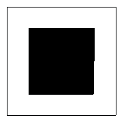

<!-- question-source:start -->
【练习 3】 1.一块正方形，一边划出15米，另一边划出10米搞绿化，剩下的面积比原来减少了1350平方米。这块地原来的面积是多少平方米？
2.一个正方形，如果它的边长增加5厘米，那么，面积就比原来增加95平方厘米。原来正方形的面积是多少平方厘米？
3.有一个正方形草坪，沿草坪四周向外修建一米宽的小路，路面面积是80平方米。求草坪的面积。
<!-- question-source:end -->

![[小学/奥数/小学奥数举一反三五年级/第04讲_长方形正方形面积/练习/answers/Q00094011A1.md]]
