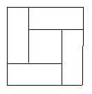

<!-- question-source:start -->
【练习 4】 1.四个完全一样的长方形和一个小正方形组成了一个大正方形，如果大、小正方形的面积分别是49平方米和4平方米，求其中一个长方形的宽。
2.正图的每条边都垂直于与它相邻的边，并且28条边的长都相等。如果此图的周长是56厘米，那么，这个图形的面积是多少？
3.正图中，正方形ABCD的边长4厘米，求长方形EFGD的面积。
<!-- question-source:end -->

![[小学/奥数/小学奥数举一反三五年级/第04讲_长方形正方形面积/练习/answers/Q00094012A1.md]]
