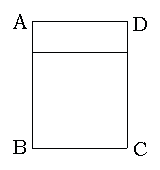

<!-- question-source:start -->
【练习 5】 1.五个同样大小的正方形拼成一个长方形，这个长方形的周长是36厘米，求每个正方形的面积是多少平方厘米？
2.有一张长方形纸，长12厘米，宽10厘米。从这张纸上剪下一个最大的正方形后，剩下部分的周长是多少厘米？
3.有一个小长方形，它和一个正方形拼成了一个大长方形ABCD（如下图），已知大长方形的面积是35平方厘米，且周长比原来小长方形的周长多10厘米。求原来小长方形的面积。
<!-- question-source:end -->

![[小学/奥数/小学奥数举一反三五年级/第04讲_长方形正方形面积/练习/answers/Q00094013A1.md]]
