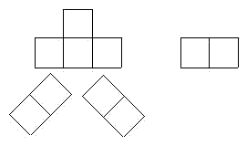

<!-- question-source:start -->
【练习 1】 1.把1------10各数填入"六一"的10个空格里，使在同一直线上的各数的和都是12。
2.把1------9各数填入"七一"的9个空格里，使在同一直线上的各数的和都是13。
3.将1------7七个自然数分别填入图中的圆圈里，使每条线上三个数的和相等。
<!-- question-source:end -->

![[小学/奥数/小学奥数举一反三五年级/第10讲_数阵/练习/answers/Q00094069A1.md]]
