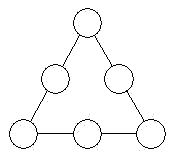

<!-- question-source:start -->
【练习 3】 1.将1------6六个数分别填入下图的○内，使每边上的三个○内数的和相等。
2.将1------9九个数分别填入下图○内，使每边上四个○内数的和都是17。
3.将1------8八个数分别填入下图的○内，使每条安上三个数的和相等。
<!-- question-source:end -->

![[小学/奥数/小学奥数举一反三五年级/第10讲_数阵/练习/answers/Q00094071A1.md]]
