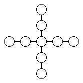

<!-- question-source:start -->
【练习 4】 1.将1------9填入下图的○中，使横、竖行五个数相加的和都等于25。
2.将1------11这十一个数分别填进下图的○里，使每条线上3个○内的数的和相等。
3.将1------8这八个数分别填入下图○内，使外圆四个数的和，内圆四个数的和以及横行、竖行上四个数的和都等于18。

<!-- question-source:end -->

![[小学/奥数/小学奥数举一反三五年级/第10讲_数阵/练习/answers/Q00094072A1.md]]
