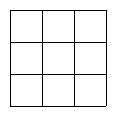

<!-- question-source:start -->
【练习 5】 1.将九个不同的自然数填入下面方格中，使每行、每列、每条对角线上三个数的积都相等。
2.将1------9九个自然数分别填入下图的九个小三角形中，使靠近大三角形每条边上五个数的和相等，并且尽可能大。这五个数之和最大是多少？
3.将1------9九个数分别填入下图○内，使外三角形边上○内数之和等于里面三角形边上○内数之和。

<!-- question-source:end -->

![[小学/奥数/小学奥数举一反三五年级/第10讲_数阵/练习/answers/Q00094073A1.md]]
