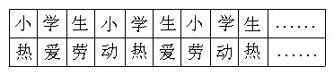

<!-- question-source:start -->
【练习 4】 1.将偶数2、4、6、8、......按下图依次排列，2014出现在哪一列？
2.把自然数按下列规律排列，865排在哪一列？

3\.
上表中，将每列上下两个字组成一组，如第一组为（小热），第二组为（学爱）。求第460组是什么？
<!-- question-source:end -->

![[小学/奥数/小学奥数举一反三五年级/第11讲_周期问题/练习/answers/Q00094082A1.md]]
