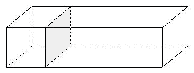

<!-- question-source:start -->
【例题 3】 一个正方体和一个长方体拼成了一个新的长方体，拼成的长方体的表面积比原来的长方体的表面积增加了50平方厘米。原正方体的表面积是多少平方厘米？

<!-- question-source:end -->

![[小学/奥数/小学奥数举一反三五年级/第13讲_长方体正方体(一)/例题/answers/Q00094096A1.md]]
