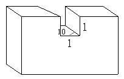

<!-- question-source:start -->
【练习 1】 1.一个长5厘米，宽1厘米，高3厘米的长方体，被切去一块后（如图），剩下部分的表面积和体积各是多少？
2.把一根长2米的长方体木料锯成1米长的两段，表面积增加了2平方分米，求这根木料原来的体积。
3.有一个长8厘米，宽1厘米，高3厘米的长方体木块，在它的左右两角各切掉一个正方体（如图），求切掉正方体后的表面积和体积各是多少？

<!-- question-source:end -->

![[小学/奥数/小学奥数举一反三五年级/第13讲_长方体正方体(一)/练习/answers/Q00094099A1.md]]
