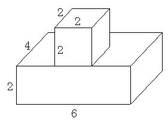

<!-- question-source:start -->
【练习 2】 1.有一个形状如下图的零件，求它的体积和表面积。（单位：厘米）。
2.有一个棱长是4厘米的正方体，从它的一个顶点处挖去一个棱长是1厘米的正方体后，剩下物体的体积和表面积各是多少？
3.如果把上题中挖下的小正方体粘在另一个面上（如图），那么得到的物体的体积和表面积各是多少？

<!-- question-source:end -->

![[小学/奥数/小学奥数举一反三五年级/第13讲_长方体正方体(一)/练习/answers/Q00094100A1.md]]
