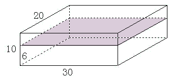

<!-- question-source:start -->
【例题 4】 有一个长方体容器（如下图），长30厘米、宽20厘米、高10厘米，里面的水深6厘米。如果把这个容器盖紧，再朝左竖起来，里面的水深应该是多少厘米？

<!-- question-source:end -->

![[小学/奥数/小学奥数举一反三五年级/第14讲_长方体正方体(二)/例题/answers/Q00094107A1.md]]
