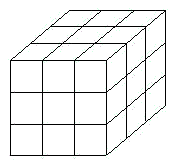

# 第15讲 长方体和正方体(三)

## 一、知识要点与思维方法

解答有关长方体和正方体的拼、切问题，除了要切实掌握长方体、正方体的特征，熟悉计算方法，仔细
分析每一步操作后表面几何体积的等比情况外，还必须知道：把一个长方体或正方体沿水平方向或垂直方向切割成两部分，新增加的表面积等于切面面积的两倍。

---

## 二、精选例题精讲与思维导航

### [[小学/奥数/小学奥数举一反三五年级/第15讲_长方体正方体(三)/例题/Q00094114.md|例题 1]]

![[小学/奥数/小学奥数举一反三五年级/第15讲_长方体正方体(三)/例题/Q00094114.md]]

### [[小学/奥数/小学奥数举一反三五年级/第15讲_长方体正方体(三)/例题/Q00094115.md|例题 2]]

![[小学/奥数/小学奥数举一反三五年级/第15讲_长方体正方体(三)/例题/Q00094115.md]]

### [[小学/奥数/小学奥数举一反三五年级/第15讲_长方体正方体(三)/例题/Q00094116.md|例题 3]]

![[小学/奥数/小学奥数举一反三五年级/第15讲_长方体正方体(三)/例题/Q00094116.md]]

### [[小学/奥数/小学奥数举一反三五年级/第15讲_长方体正方体(三)/例题/Q00094117.md|例题 4]]

![[小学/奥数/小学奥数举一反三五年级/第15讲_长方体正方体(三)/例题/Q00094117.md]]

### [[小学/奥数/小学奥数举一反三五年级/第15讲_长方体正方体(三)/例题/Q00094118.md|例题 5]]

![[小学/奥数/小学奥数举一反三五年级/第15讲_长方体正方体(三)/例题/Q00094118.md]]

---

## 三、变式拓展与举一反三练习

### [[小学/奥数/小学奥数举一反三五年级/第15讲_长方体正方体(三)/练习/Q00094119.md|练习 1]]

![[小学/奥数/小学奥数举一反三五年级/第15讲_长方体正方体(三)/练习/Q00094119.md]]

### [[小学/奥数/小学奥数举一反三五年级/第15讲_长方体正方体(三)/练习/Q00094120.md|练习 2]]

![[小学/奥数/小学奥数举一反三五年级/第15讲_长方体正方体(三)/练习/Q00094120.md]]

### [[小学/奥数/小学奥数举一反三五年级/第15讲_长方体正方体(三)/练习/Q00094121.md|练习 3]]

![[小学/奥数/小学奥数举一反三五年级/第15讲_长方体正方体(三)/练习/Q00094121.md]]

### [[小学/奥数/小学奥数举一反三五年级/第15讲_长方体正方体(三)/练习/Q00094122.md|练习 4]]

![[小学/奥数/小学奥数举一反三五年级/第15讲_长方体正方体(三)/练习/Q00094122.md]]

### [[小学/奥数/小学奥数举一反三五年级/第15讲_长方体正方体(三)/练习/Q00094123.md|练习 5]]

![[小学/奥数/小学奥数举一反三五年级/第15讲_长方体正方体(三)/练习/Q00094123.md]]

