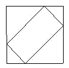

<!-- question-source:start -->
【例题 2】 正图正方形中套着一个长方形，正方形的边长是12厘米，长方形的四个角的顶点把正方形的四条边各分成两段，其中长的一段是短的2倍。求中间长方形的面积。

<!-- question-source:end -->

![[小学/奥数/小学奥数举一反三五年级/第18讲_组合图形面积(一)/例题/answers/Q00094145A1.md]]
