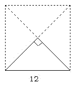

# 第18讲 组合图形面积（一）

## 一、知识要点与思维方法

组合图形是由两个或两个以上的简单的几何图形组合而成的。组合的形式分为两种：一是拼合组合，二是重叠组合。由于组合图形具有条件相等的特点，往往使得问题的
解决无从下手。要正确
解答组合图形的面积，应该注意以下几点：
1.切实掌握有关简单图形的概念、公式，牢固建立空间观念；
2.仔细观察，认真思考，看清所求图形是由哪几个基本图形组合而成的；
3.适当采用增加辅助线等方法帮助
解题；
4，采用割、补、分
解、代换等方法，可将复杂问题变得简单。

---

## 二、精选例题精讲与思维导航

### [[小学/奥数/小学奥数举一反三五年级/第18讲_组合图形面积(一)/例题/Q00094144.md|例题 1]]

![[小学/奥数/小学奥数举一反三五年级/第18讲_组合图形面积(一)/例题/Q00094144.md]]

### [[小学/奥数/小学奥数举一反三五年级/第18讲_组合图形面积(一)/例题/Q00094145.md|例题 2]]

![[小学/奥数/小学奥数举一反三五年级/第18讲_组合图形面积(一)/例题/Q00094145.md]]

### [[小学/奥数/小学奥数举一反三五年级/第18讲_组合图形面积(一)/例题/Q00094146.md|例题 3]]

![[小学/奥数/小学奥数举一反三五年级/第18讲_组合图形面积(一)/例题/Q00094146.md]]

### [[小学/奥数/小学奥数举一反三五年级/第18讲_组合图形面积(一)/例题/Q00094147.md|例题 4]]

![[小学/奥数/小学奥数举一反三五年级/第18讲_组合图形面积(一)/例题/Q00094147.md]]

### [[小学/奥数/小学奥数举一反三五年级/第18讲_组合图形面积(一)/例题/Q00094148.md|例题 5]]

![[小学/奥数/小学奥数举一反三五年级/第18讲_组合图形面积(一)/例题/Q00094148.md]]

---

## 三、变式拓展与举一反三练习

### [[小学/奥数/小学奥数举一反三五年级/第18讲_组合图形面积(一)/练习/Q00094149.md|练习 1]]

![[小学/奥数/小学奥数举一反三五年级/第18讲_组合图形面积(一)/练习/Q00094149.md]]

### [[小学/奥数/小学奥数举一反三五年级/第18讲_组合图形面积(一)/练习/Q00094150.md|练习 2]]

![[小学/奥数/小学奥数举一反三五年级/第18讲_组合图形面积(一)/练习/Q00094150.md]]

### [[小学/奥数/小学奥数举一反三五年级/第18讲_组合图形面积(一)/练习/Q00094151.md|练习 3]]

![[小学/奥数/小学奥数举一反三五年级/第18讲_组合图形面积(一)/练习/Q00094151.md]]

### [[小学/奥数/小学奥数举一反三五年级/第18讲_组合图形面积(一)/练习/Q00094152.md|练习 4]]

![[小学/奥数/小学奥数举一反三五年级/第18讲_组合图形面积(一)/练习/Q00094152.md]]

### [[小学/奥数/小学奥数举一反三五年级/第18讲_组合图形面积(一)/练习/Q00094153.md|练习 5]]

![[小学/奥数/小学奥数举一反三五年级/第18讲_组合图形面积(一)/练习/Q00094153.md]]

