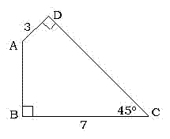

<!-- question-source:start -->
【练习 1】 1.求四边形ABCD的面积。（单位：厘米）
2.已知正方形ABCD的边长是7厘米，求正方形EFGH的面积。

3.有一个梯形，它的上底是5厘米，下底7厘米。如果只把上底增加3厘米，那么面积就增加4.5平方厘米。求原来梯形的面积。
<!-- question-source:end -->

![[小学/奥数/小学奥数举一反三五年级/第18讲_组合图形面积(一)/练习/answers/Q00094149A1.md]]
