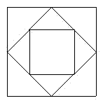

<!-- question-source:start -->
【练习 2】 1.（如下图）已知大正方形的边长是12厘米，求中间最小正方形的面积。
2.正图长方形ABCD的面积是16平方厘米，E、F都是所在边的中点，求三角形AEF的面积。
3.求下图（上右图）长方形ABCD的面积（单位：厘米）。

<!-- question-source:end -->

![[小学/奥数/小学奥数举一反三五年级/第18讲_组合图形面积(一)/练习/answers/Q00094150A1.md]]
