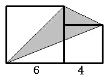

<!-- question-source:start -->
【练习 3】 1.图中两个正方形的边长分别是6厘米和4厘米，求阴影部分的面积。
2.下图中两个完全一样的三角形重叠在一起，求阴影部分的面积。（单位：厘米）
3.下图中，甲三角形的面积比乙三角形的面积大多少平方厘米？

<!-- question-source:end -->

![[小学/奥数/小学奥数举一反三五年级/第18讲_组合图形面积(一)/练习/answers/Q00094151A1.md]]
