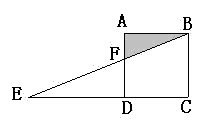

<!-- question-source:start -->
【练习 4】 1.如下图，正方形ABCD中，AB=4厘米，EC=10厘米，求阴影部分的面积。
2.在一个直角三角形铁皮上剪下一块正方形，并使正方形面积尽可能大，正方形的面积是多少？（单位：厘米）
3.图中BC=10厘米，EC=8厘米，且阴影部分面积比三角形EFG的面积大10平方厘米。求平行四边形的面积。

<!-- question-source:end -->

![[小学/奥数/小学奥数举一反三五年级/第18讲_组合图形面积(一)/练习/answers/Q00094152A1.md]]
