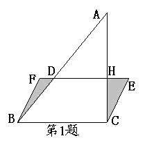

<!-- question-source:start -->
【练习 5】 1.如图，平行四边形BCEF中，BC=8厘米，直角三角形中，AC=10厘米，阴影部分面积比三角形ADH的面积大8平方厘米。求AH长多少厘米？
2.图中三个正方形的边长分别是1厘米、2厘米和3厘米，求图中阴影部分的面积。
3.正方形的边长是2(a+b)，已知图中阴影部分B的面积是7平方厘米，求阴影部分A和C的和是多少平方厘米？

<!-- question-source:end -->

![[小学/奥数/小学奥数举一反三五年级/第18讲_组合图形面积(一)/练习/answers/Q00094153A1.md]]
