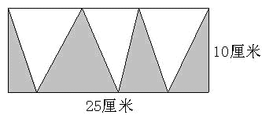

<!-- question-source:start -->
【练习 1】 1.求下图中阴影部分的面积。
2.求图中阴影部分的面积。（单位：厘米）
3.下图的长方形是一块草坪，中间有两条宽1米的走道，求植草的面积。

<!-- question-source:end -->

![[小学/奥数/小学奥数举一反三五年级/第19讲_组合图形面积(二)/练习/answers/Q00094159A1.md]]
