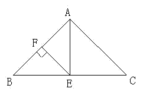

<!-- question-source:start -->
【练习 2】 1.下图中，三角形ABC的面积是36平方厘米，三角形ABE与三角形AEC的面积相等，如果AB=9厘米，FB=FE，求三角形AFE的面积。

2.图中两个正方形的边长分别是10厘米和6厘米，求阴影部分的面积。
3.图中三角形ABC的面积是36平方厘米，AC长8厘米，DE长3厘米，求阴影部分的面积（ADFC不是正方形）。
<!-- question-source:end -->

![[小学/奥数/小学奥数举一反三五年级/第19讲_组合图形面积(二)/练习/answers/Q00094160A1.md]]
