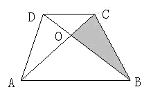

<!-- question-source:start -->
【练习 3】 1.如下图，图中BO=2DO，阴影部分的面积是4平方厘米，求梯形ABCD的面积是多少平方厘米？
2.下图的梯形ABCD中，下底是上底的2倍，E是AB的中点。那么梯形ABCD的面积是三角形BDE面积的多少倍？
3.下图梯形ABCD中，AD=7厘米，BC=12厘米，梯形高8厘米，求三角形BOC的面积比三角形AOD的面积大多少平方厘米？
<!-- question-source:end -->

![[小学/奥数/小学奥数举一反三五年级/第19讲_组合图形面积(二)/练习/answers/Q00094161A1.md]]
