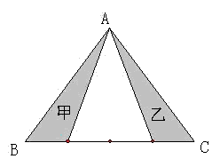

<!-- question-source:start -->
【练习 4】 1.把下图三角形的底边BC四等分，在下面括号里填上"＞"、"＜"或"="。
甲的面积（ ）乙的面积。
2.如图，在三角形ABC中，D是BC的中点，E、F是AC的三等分点。已知三角形的面积是108平方厘米，求三角形CDE的面积。
3.下图中，BD=2厘米，DE=4厘米，EC=2厘米，F是AE的中点，三角形ABC的BC边上的高是4厘米，阴影面积是多少平方厘米？

<!-- question-source:end -->

![[小学/奥数/小学奥数举一反三五年级/第19讲_组合图形面积(二)/练习/answers/Q00094162A1.md]]
