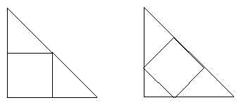

<!-- question-source:start -->
【练习 5】 1.边长是8厘米的正三角形的面积是边长为2厘米的正三角形面积的多少倍？
2.一个梯形与一个三角形等高，梯形下底的长是上底的2倍，梯形上底的长又是三角形底长的2倍。这个梯形的面积是三角形面积的多少倍？
3.有两种自然的放法将正方形内接于等腰直角三角形。已知等腰直角三角形的面积是36平方厘米，两个正方形的面积分别是多少？
<!-- question-source:end -->

![[小学/奥数/小学奥数举一反三五年级/第19讲_组合图形面积(二)/练习/answers/Q00094163A1.md]]
