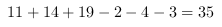

<!-- question-source:start -->
【练习 5】 1，用红笔在一根木棍上做了三次记号，第一次把木棍分成12等份，第二次把棍分成15等份，第三次把木棍分成20等份，然后沿着这些红记号把木棍锯开，一共锯成多少小段？
15 20的最小公倍数,也就是60,这样每一种分法对应的长度都是整数.12等分的
每份长5,15等分的 每份长4,20等分的
每份长3.然后开始找重复.长度为5和4的在20.40重复(在0和60重复?0和60没有记号,所以无所谓重复,以下同理,不再
解释)长度为4和3的在12.24.36.48重复,长度为3和5的在15.30.45重复,长度为3
4
5三种记号的重复不存在.这样共有不重复的记号个.所以可以分成36段.
2，父子二人在雪地散步，父亲在前，每步80厘米，儿子在后，每步60厘米。在120米内一共留下多少个脚印？
3，在96米长的距离内挂红、绿、黄三种颜色的气球，绿气球每隔6米挂一个，黄气球每隔4米挂一个，。如果绿气球和黄气球重叠的地方就改挂一个红气球，那么，除两端外，中间挂有多少个红气球？
<!-- question-source:end -->

![[小学/奥数/小学奥数举一反三五年级/第27讲_最小公倍数(二)/练习/answers/Q00094243A1.md]]
