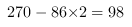

<!-- question-source:start -->
【练习 5】 1，甲、乙两车同时从A、B两地相向出发，3小时后，两车还相距120千米。又行3小时，两车又相距120千米。A、B两地相距多少千米？
解:\
\
\
(千米)\
答:AB两地相距360千米
解析
3小时两车还相距120千米,继续行驶到3时,两车又相距120千米,3小时,则这两小时内两车共行了千米,则两车的速度和是:千米,则两地相距千米.\
首先根据"3小时后,两车还相距120千米,又行驶3小时,两车又相距120千米"求出两车速度和是完成本题的关键.
2，快、慢两车早上6时同时从甲、乙两地相向开出，中午12时两车还相距50千米。继续行驶到14时，两车又相距170千米。甲、乙两地相距多少千米？
解:12时-6时=6小时\
14时时=2小时\
\
\
\
(千米)\
答:两地相距710千米.
解析：中午12时两车还相距50千米,继续行驶到14时,两车又相距170千米,中午12时到14时为2小时,则这两小时内两车共行了50+170千米,则两车的速度和是:千米,上午6时到中午12时为6小时,两车共行6小进可行千米,此时两车还相距50千米,则两地相距千米.\
首先根据"中午12时两车还相距50千米,继续行驶到14时,两车又相距170千米"求出两车速度和是完成本题的关键.
3，甲、乙两人分别从A、B两地同时相向而行，匀速前进。如果各人按原定速度前进，4小时相遇；如果两人各自比原计划少走1千米，则5小时相遇。A、B两地相距多少千米？
<!-- question-source:end -->

![[小学/奥数/小学奥数举一反三五年级/第28讲_行程问题(一)/练习/answers/Q00094253A1.md]]
