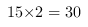
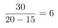
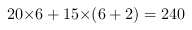

<!-- question-source:start -->
【练习 3】 （1）兄弟二人同时从家出发去学校，哥哥每分钟走80米，弟弟每分钟走60米。出发10分钟钟后，哥哥返回家中取文具，然后立即骑车以每分钟310米的速度去追弟弟。哥哥骑车几分钟追上弟弟？
（2）快车每小时行60千米，慢车每小时行40千米，两车同时从甲地开往乙地。出发0.5小时后，快车因故停下修车1.5小时。修好车后，快车仍用原速前进，经过几小时才能追上慢车？
0.5小时后，快车走了60×0.5＝30千米，当快车再次出发时，慢车走了40×2＝80千米，此时，两车相距80－30＝50千米，两车速度差为60－40＝20千米/时，快车追上慢车时间＝50÷20＝2.5(小时)
（3）甲、乙二人加工同样多的零件，甲每小时加工20个，乙每小时加工15个。一天，乙比甲早工作2小时，到下午二人同时完成了加工任务。他俩一共加工了多少个零件？在这两小时内,乙做了30个零件,说明在之后的时间里,甲比乙多做了30个,而每个小时多做5个,相除即得到甲的工作时间.\
个\
小时\
共做了个
<!-- question-source:end -->

![[小学/奥数/小学奥数举一反三五年级/第29讲_行程问题(二)/练习/answers/Q00094261A1.md]]
