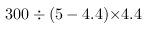
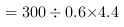
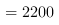
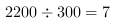
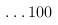
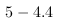
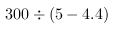

<!-- question-source:start -->
【练习 4】 （1）爸爸和小明同时从同一地点出发，沿相同方向在环形跑道上跑步。爸爸每分钟跑150米，小明每分钟跑120米，如果跑道全长900米，问：至少经营几分钟爸爸从小明身后追上小明？
解：
900÷(150－120)
＝900÷30
＝30(分钟)
答：30分钟后爸爸追上小明.
（2）在300米长的环形跑道上，甲、乙二人同时同地同向跑步，甲每秒跑5米，乙每秒跑4.4米。两人起跑后的第一次相遇点在起跑线前多少米？
解:\
\
(米), \
(圈)(米) \
答:两人起跑后的第一次相遇点在起跑线前100米.
解析
甲每秒跑5米,乙每秒跑4.4米,则甲每秒比乙多跑米,又甲、乙二人同时同地同向跑步,所以两人起跑后的第一次相遇时,甲正好比乙多跑一周即300米,所以两人相遇所用时间是秒,此时乙跑了米,除以环形跑道的长度,余数即可得两人起跑后的第一次相遇点在起跑线前多少米.
（3）环湖一周共400米，甲、乙二人同时从同一地点同方向出发，甲过10分钟第一次从乙身后追上乙。若二人同时从同一地点反向而行，只要2分钟二人就相遇。求甲、乙的速度。
解：设乙的速度是每分钟x米，
那么甲的速度为200－x米；
400÷2＝200(米)，
10×(200－x－x)＝400
2 000－20x＝400
20x＝1 600
x＝80
甲的速度：200－80＝120(米)
答：甲的速度是每分钟120米，乙的速度是每分钟80米.
故
<!-- question-source:end -->

![[小学/奥数/小学奥数举一反三五年级/第29讲_行程问题(二)/练习/answers/Q00094262A1.md]]
