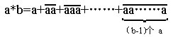

<!-- question-source:start -->
【练习 3】 1、如果1\*5=1+11+111+1111+11111，2\*4=2+22+222+2222，3\*3=3+33+333，......那么4\*4=\_\_\_\_\_\_\_\_。
2、规定， 那么8\*5=\_\_\_\_\_\_\_\_。
3、如果2\*1=1/2，3\*2=1/33，4\*3=1/444，那么（6\*3）÷（2\*6）=\_\_\_\_\_\_\_\_。
<!-- question-source:end -->

![[小学/奥数/小学奥数举一反三六年级/第01讲_定义新运算/练习/answers/Q00094381A1.md]]
