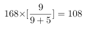
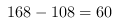

<!-- question-source:start -->
【练习 5】 1、有一块菜地和一块麦地，菜地的一半和麦地的1/3放在一起是13公顷，麦地的一半和菜地的1/3放在一起是12公顷，那么，菜地有多少公顷？
2、师徒两人加工同样多的零件，师傅要10分钟，徒弟要18分钟。两人共同加工零件168个，如果要在相同的时间内完成，两人各应加工零件多少个？
总量相同,则时间和效率成反比,\
已知,加工同样多的零件,师傅和徒弟所需时间比为,\
可得:师傅和徒弟的效率比为9:5;\
因为时间相同,总量和效率成正比,\
可得:在相同的时间内,师傅和徒弟加工零件数之比为9:5;\
所以师傅应该加工个零件\
徒弟应该加工个零件.
3、有5元和2元的人民币若干张，其金额之比为15：4。如果5元人民币减少6张，则两种人民币的张数相等。求原来两种人民币的张数各是多少？
<!-- question-source:end -->

![[小学/奥数/小学奥数举一反三六年级/第07讲_转化单位1(二)/练习/answers/Q00094443A1.md]]
