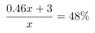
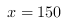
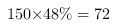

<!-- question-source:start -->
【练习 1】 1、某小学低年级原有少先队员是非少先队员的1/3，后来又有39名同学加入少先队组织。这样，少先队员的人数是非少先队员的7/8。低年级有学生多少人？
2、王师傅生产一批零件，不合格产品是合格产品的1/19，后来从合格产品中又发现了2个不合格产品，这时算出产品的合格率是94％。合格产品共有多少个？
3、某校六年级上学期男生占总人数的54％，本学期转进3名女生，转走3名男生，这时女生占总人数的48％。现在有男生多少人？
设原来总人数为x人,则男生为0.54x人,女生为0.46x人\
由于转走的人数和转进的人数一样多,那么现在班级的总人数也为x人.\
根据题意列出方程,\
解得人.\
则现在的女生人数为人.
<!-- question-source:end -->

![[小学/奥数/小学奥数举一反三六年级/第08讲_转化单位1(三)/练习/answers/Q00094449A1.md]]
