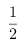
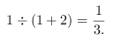
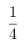
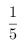
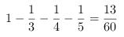
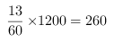

<!-- question-source:start -->
【练习 3】 1、有两根塑料绳，一根长80米，另一根长40米，如果从两根上各剪去同样长的一段后，短绳剩下的长度是长绳剩下的2/7，两根绳各剪去多少米？
2、今年父亲40岁，儿子12岁，当儿子的年龄是父亲的5/12时，儿子多少岁？
3、仓库里原来存大米和面粉袋数相等，运出800袋大米和500袋面粉后，仓库里所剩的大米袋数时面粉的3/4，仓库里原有大米和面粉各多少袋？
4、甲、乙、丙、丁四个筑路队共筑1200米长的一段公路，甲队筑的路时其他三个队的1/2，乙队筑的路时其他三个队的1/3，丙队筑的路时其他三个队的1/4，丁队筑了多少米？
甲队筑的路时其他三个队的,那么甲：(乙+丙+丁)=1:2,\
即甲占了全部的\
同理可得,乙占了,丙占了,那么\
丁占了\
即米.
<!-- question-source:end -->

![[小学/奥数/小学奥数举一反三六年级/第08讲_转化单位1(三)/练习/answers/Q00094451A1.md]]
