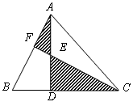
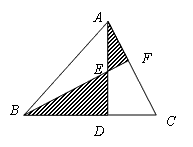
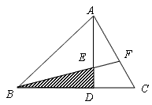

<!-- question-source:start -->
【练习 1】 1、如图，AE＝ED，BC=3BD，S△ABC＝30平方厘米。求阴影部分的面积。

2、如图所示，AE=ED，DC＝1/3BD，S△ABC＝21平方厘米。求阴影部分的面积。
3、如图所示，DE＝1/2AE，BD＝2DC，S△EBD＝5平方厘米。求三角形ABC的面积。

<!-- question-source:end -->

![[小学/奥数/小学奥数举一反三六年级/第18讲_面积计算(一)/练习/answers/Q00094549A1.md]]
