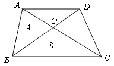
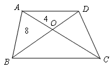
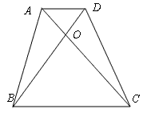

<!-- question-source:start -->
【练习 2】 1、两条对角线把梯形ABCD分割成四个三角形，（如图所示），已知两个三角形的面积，求另两个三角形的面积是多少？
2、已知AO＝1/3OC，求梯形ABCD的面积（如图所示）。
3、已知三角形AOB的面积为15平方厘米，线段OB的长度为OD的3倍。求梯形ABCD的面积。（如图所示）。
<!-- question-source:end -->

![[小学/奥数/小学奥数举一反三六年级/第18讲_面积计算(一)/练习/answers/Q00094550A1.md]]
