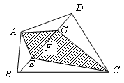
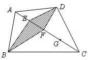
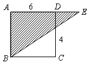

<!-- question-source:start -->
【练习 3】 1、四边形ABCD的对角线BD被E、F、G三点四等分，且四边形AECG的面积为15平方厘米。求四边形ABCD的面积（如图）。

2、已知四边形ABCD的对角线被E、F、G三点四等分，且阴影部分面积为15平方厘米。求四边形ABCD的面积（如图所示）。
3、如图所示，求阴影部分的面积（ABCD为正方形）。
<!-- question-source:end -->

![[小学/奥数/小学奥数举一反三六年级/第18讲_面积计算(一)/练习/answers/Q00094551A1.md]]
