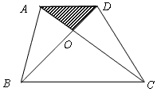
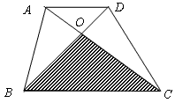
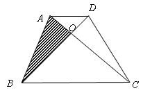

<!-- question-source:start -->
【练习 4】 1、如图所示，阴影部分面积是4平方厘米，OC＝2AO。求梯形面积。

2、已知OC＝2AO，S△BOC＝14平方厘米。求梯形的面积（如图所示）。  

3、已知S△AOB＝6平方厘米。OC＝3AO，求梯形的面积（如图所示）。      

<!-- question-source:end -->

![[小学/奥数/小学奥数举一反三六年级/第18讲_面积计算(一)/练习/answers/Q00094552A1.md]]
