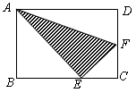
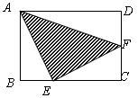
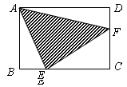

<!-- question-source:start -->
【练习 5】 1、如图所示，长方形ABCD的面积是20平方厘米，三角形ADF的面积为5平方厘米，三角形ABE的面积为7平方厘米，求三角形AEF的面积。

2、如图所示，长方形ABCD的面积为20平方厘米，S△ABE＝4平方厘米，S△AFD＝6平方厘米，求三角形AEF的面积。

3、如图所示，长方形ABCD的面积为24平方厘米，三角形ABE、AFD的面积均为4平方厘米，求三角形AEF的面积。
<!-- question-source:end -->

![[小学/奥数/小学奥数举一反三六年级/第18讲_面积计算(一)/练习/answers/Q00094553A1.md]]
