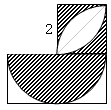
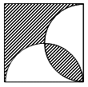
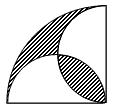

<!-- question-source:start -->
【练习 2】 1、计算下面图形中阴影部分的面积（单位：厘米）。

2、计算下面图形中阴影部分的面积（单位：厘米，正方形边长4）。

3、计算下面图形中阴影部分的面积（单位：厘米，正方形边长4）。

<!-- question-source:end -->

![[小学/奥数/小学奥数举一反三六年级/第19讲_面积计算(二)/练习/answers/Q00094560A1.md]]
