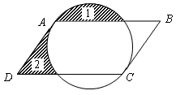
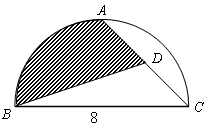
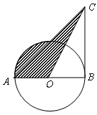

<!-- question-source:start -->
【练习 3】 1、如图所示，圆的周长为12.56厘米，AC两点把圆分成相等的两段弧，阴影部分（1）的面积与阴影部分（2）的面积相等，求平行四边形ABCD的面积。

2、如图所示，直径BC＝8厘米，AB＝AC，D为AC的中点，求阴影部分的面积。

3、如图所示，AB＝BC＝8厘米，求阴影部分的面积。
<!-- question-source:end -->

![[小学/奥数/小学奥数举一反三六年级/第19讲_面积计算(二)/练习/answers/Q00094561A1.md]]
