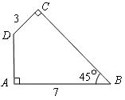
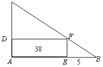
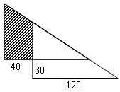

<!-- question-source:start -->
【练习 4】 1、如图所示，求四边形ABCD的面积。
2、如图所示，BE长5厘米，长方形AEFD面积是38平方厘米。求CD的长度。

3、图是两个完全一样的直角三角形重叠在一起，按照图中的已知条件求阴影部分的面积（单位：厘米）。
<!-- question-source:end -->

![[小学/奥数/小学奥数举一反三六年级/第19讲_面积计算(二)/练习/answers/Q00094562A1.md]]
