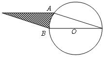
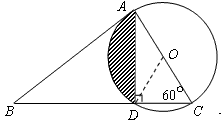
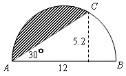
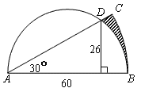

<!-- question-source:start -->
【练习 5】 1、如图所示，∠1＝15度，圆的周长位62.8厘米，平行四边形的面积为100平方厘米。求阴影部分的面积（得数保留两位小数）。
2、如图所示，三角形ABC的面积是31.2平方厘米，圆的直径AC＝6厘米，BD：DC＝3：1。求阴影部分的面积。
3、如图所示，求阴影部分的面积（单位：厘米。得数保留两位小数）。

4、如图所示，求阴影部分的面积（单位：厘米。得数保留两位小数）。      

<!-- question-source:end -->

![[小学/奥数/小学奥数举一反三六年级/第19讲_面积计算(二)/练习/answers/Q00094563A1.md]]
