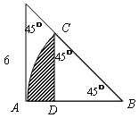
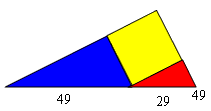

<!-- question-source:start -->
【练习 1】 1、如图所示，求阴影部分的面积（单位：厘米）
2、如图所示，用一张斜边为29厘米的红色直角三角形纸片，一张斜边为49厘米的蓝色直角三角形纸片，一张黄色的正方形纸片，拼成一个直角三角形。求红蓝两张三角形纸片面积之和是多少？
<!-- question-source:end -->

![[小学/奥数/小学奥数举一反三六年级/第20讲_面积计算(三)/练习/answers/Q00094569A1.md]]
