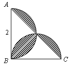
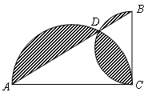
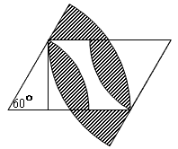

<!-- question-source:start -->
【练习 2】 1、如图所示，△ABC是等腰直角三角形，求阴影部分的面积（单位：厘米）。

2、如图所示，三角形ABC是直角三角形，AC长4厘米，BC长2厘米。以AC、BC为直径画半圆，两个半圆的交点在AB边上。求图中阴影部分的面积。   

3、如图所示，图中平行四边形的一个角为600，两条边的长分别为6厘米和8厘米，高为5.2厘米。求图中阴影部分的面积。
<!-- question-source:end -->

![[小学/奥数/小学奥数举一反三六年级/第20讲_面积计算(三)/练习/answers/Q00094570A1.md]]
