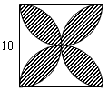
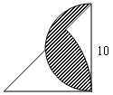
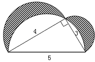

<!-- question-source:start -->
【练习 3】 1、求下面各图形中阴影部分的面积（单位：厘米）。
2、求下面各图形中阴影部分的面积（单位：厘米）。

3、求下面各图形中阴影部分的面积（单位：厘米）。
<!-- question-source:end -->

![[小学/奥数/小学奥数举一反三六年级/第20讲_面积计算(三)/练习/answers/Q00094571A1.md]]
